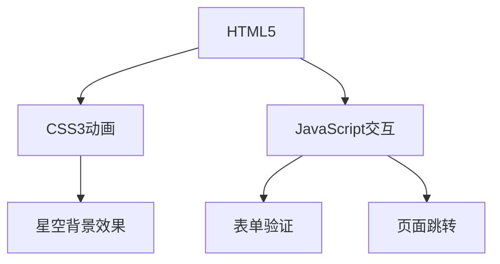

# 宇宙风格登录系统 - 星际主题

## 项目概述
一个基于现代Web技术的星际主题认证系统前端实现，包含完整的用户认证流程：登录、注册和密码重置功能。采用响应式设计，适配多种设备屏幕尺寸。

## 核心功能
- **用户登录**：
  - 用户名/密码认证
  - 表单验证
  - 错误提示
- **新用户注册**：
  - 账号创建流程
  - 表单验证
- **密码重置**：
  - 通过邮箱验证
  - 安全令牌机制

## 技术架构


## 技术栈
- **前端**：
  - HTML5语义化标签
  - CSS3动画与过渡效果
  - JavaScript DOM操作
- **工具链**：
  - 无依赖，纯原生实现

## 快速部署
1. 克隆仓库：
```bash
git clone https://github.com/your-repo/universe-login.git
```
2. 启动服务：
```bash
# 使用任意静态服务器
npx serve
```
3. 访问地址：
```
http://localhost:3000
```

## 系统特性
- **视觉效果**：
  - 动态星空背景
  - 科幻UI元素
  - 平滑过渡动画
- **功能特性**：
  - 响应式布局
  - 表单验证
  - 无障碍访问支持

## 贡献指南
欢迎提交Pull Request。请确保：
- 代码风格一致
- 包含必要的测试
- 更新相关文档

## 许可证
MIT License
